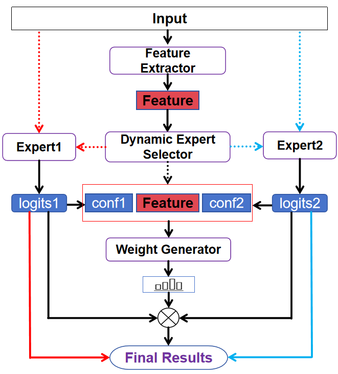

# [Classification method of impressionist oil painting style based on sparse heterogeneous mixing network](https://arxiv.org/abs/2405.14458)


Official PyTorch implementation of **SHMNet**.

<p align="center">
   <br>
  The model structure of SHMNet.
</p>


<details>
  <summary>
  <font size="+1">Abstract</font>
  </summary>
The rapid advancement of artificial intelligence is profoundly reshaping methodologies in art research, with the AI for Science paradigm pioneering new pathways for analyzing painting art. This study focuses on Impressionism—a revolutionary art movement. Its unique expression of light and shadow not only transformed traditional painting but also provides a highly valuable paradigm for computer vision analysis. Currently, intelligent analysis of Impressionist paintings faces a core challenge: the tension between the unified style of the movement and the creative diversity of individual artists. Classifying Impressionist oil paintings encounters dual difficulties: high inter-class similarity and significant intra-class variations, leading to suboptimal performance of traditional classification methods.

This research innovatively proposes a Sparse Heterogeneous Mixing Network (SHMNet), with core contributions in:
(1) Decision-level Heterogeneous Fusion Framework: By leveraging high-level semantic complementarity, it preserves Swin Transformer’s global dependency modeling and ConvNeXt’s local context extraction capabilities, avoiding structural damage from feature-level fusion;
(2) Dynamic Sparse Gating Mechanism: Introducing differentiable policy gradients to optimize routing selection, enabling adaptive switching between single-branch (30% samples) and multi-branch (70% samples) inference. This reduces computational costs by 14.4% while achieving 94.77% Top-1 accuracy.

We construct Impressionism-5.5K, a dataset of 5,543 expert-annotated paintings covering six artists across different creative periods, validating the method’s robustness. SHMNet achieves a state-of-the-art Top-1 accuracy of 94.77% in fine-grained artistic style classification, significantly outperforming existing benchmarks.
</details>

## Installation
`conda` virtual environment is recommended. 
```
conda create -n myenv python=3.9
conda activate myenv 
pip install -r requirements.txt 
```
## Dataset
This project utilizes a self-built dataset, which is currently not publicly available. 
If you need access, please contact [gengjing_qianye@163.com] or submit an issue request.
If using other datasets, please store the custom data in the following structure:
```
data/
├── train/
│   ├── class1/
│   └── class2/
└── test/
    ├── class1/
    └── class2/
```

## Training
```bash
python pre_train.py --model resnet50 --weights ResNet50_Weights.DEFAULT --results results/exp2
```
```bash
python pre_train.py --model mobilenet_l --weights MobileNet_V3_Large_Weights.DEFAULT --results results/exp2
```
```bash
python pre_train.py --model ef2s --weights EfficientNet_V2_L_Weights.DEFAULT --results results/exp2
```
```bash
python pre_train.py --model convnext_s --weights ConvNeXt_Small_Weights.DEFAULT --results results/exp2
```
```bash
python pre_train.py --model swin_s --weights Swin_S_Weights.DEFAULT --results results/exp2
```
Ours [SHMNet-sparse(swin+mobile)]:
```bash
python SHMNet_sparse_train1.py --model SHMNet2_1 --results results/exp1 
python SHMNet_sparse_train2.py --model SHMNet2_1 --weights results/exp1/SHMNet2_1_train1_results/best_model.pth --results results/exp1
```

## validation
```bash
python val.py --model SHMNet2_1 --weights results/0/SHMNet2_1_train1_results/best_model.pth --results results/val
```

## Prediction
```bash
python predict.py --model SHMNet2_1 --path your/path
```

## Model Deployment
```bash
python app.py
```
Visit http://localhost:5000/ to view the frontend interface
